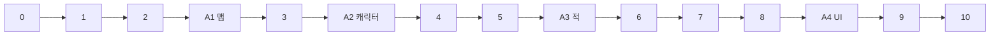

# Phase 1a (A′) Slice-01 — 작업 순서 & 체크리스트

> **완료 정의 SSOT:** spec 레포 `docs/qa/QA-030_Slice01_PlayableContract.md`  
> **핀:** `spec_ref.json` → commit `7a20da9` @ `staging`  
> **용어:** README/AGENTS의 **Phase 1a** = 본 문서의 **Phase A′ Slice-01** (동일 스코프).

---

## 0. 시작 전 (1회)

| # | 작업 | 완료 기준 |
|---|------|-----------|
| 0.1 | `spec_ref.json`·`data/slice01/manifest.json`와 spec pin 일치 확인 | ID·`contract`·`blueprint_id` 불일치 없음 |
| 0.2 | QA-030 §1 In-scope / Non-goal 숙지 | Non-goal 기능을 “스텁만”으로 제한할 수 있음 |
| 0.3 | Godot **4.5.1**로 `project.godot` Import | `main.tscn` 실행 시 bootstrap 로그 정상 |
| 0.4 | spec에서 Slice-01 관련 문서 경로 북마크 (규칙 본문은 spec만 수정) | 아래 [Spec 참조](#spec-참조) 표 |

**현재 레포 베이스라인 (2026-06-03):** `GameBootstrap` autoload, `manifest.json` 골격, `main` 스텁만 존재 → 아래 1단계부터 순차 구현.

---

## 작업 원칙 (전 단계 공통)

1. **ID 1:1** — `tank_anchor_guard`, `ENC-NORM-001`, `DBP-DEMO-001` 등 QA-030 §2 문자열 그대로. 별칭·임의 `ENC-###` 하드코딩 금지.
2. **미등록 ID → abort** — 런타임/로드 시 `ENC-000` §8 정신 (로그+중단 또는 에디터 assert).
3. **규칙 SSOT 복사 금지** — F/QA 전문을 코드 주석에 붙이지 말고, spec 경로 + 짧은 `## ref:` 한 줄만.
4. **Non-goal은 스텁** — haul·허브·Recovery 풀·서브 auto·`ENC-3RD` 실플레이 없음 (`QA-030` §1).
5. **아트는 코드와 병렬하지 않음** — 아래 [전체 순서 (고정)](#전체-순서-고정)의 **A1~A4**만 순서대로 수행. 코드 단계 중에는 **플레이스홀더(캡슐·박스·기본 UI)** 만 사용.
6. **데모 비주얼 (AI 보조 모델링)** — QA-030 Non-goal인 **아트/사운드/로컬라이즈 최종본**은 하지 않되, 데모 인상용으로 **AI 툴로 적당한 3D·UI 스킨**까지는 한다. 리깅·고폴리·전 맵 연출·Blender 마감은 하지 않음. 단계별 **시간 상한** 준수 (아래 A표).

### 아트 범위 vs Non-goal

| 구분 | Slice-01에서 하는 것 | 하지 않는 것 (1b+) |
|------|---------------------|-------------------|
| 맵 | [MAP-DEMO-001 범위](#map-demo-001-범위-slice-01-고정) — 6룸 그래프·`RM-ADV-01` 전투장 위주 | 7룸째·다층·Patrol graph·함정·haul 노드·풀 RM 파일 |
| 캐릭터 | 4 Identity 역할이 한눈에 구분되는 메쉬 | 코스튬 파이프·컷신용 애니 풀세트 |
| 적 | `ENC-NORM-001` 전열·fodder 3종 실루엣 (`EN-001` 방패 체급) | 전 ENC 카탈로그·보스 연출 |
| UI | `UI-005`·전투 HUD **데모 가독성** | haul·허브·상점·로컬라이즈 최종 |

**산출 경로:** `assets/slice01/` (맵·캐릭터·적·ui 하위) → Godot Import → 해당 씬에 **교체**만 (로직 ID 변경 없음).

---

## MAP-DEMO-001 범위 (Slice-01 고정)

**SSOT:** spec `DBP-DEMO-001` §5~6. 본 절은 구현·A1 아트의 **맵 상한/하한**만 고정한다 (spec에 m² 수치 없음).

### 논리 범위 (필수)

| 항목 | 값 |
|------|-----|
| `mapId` | `MAP-DEMO-001` |
| Concept Zone | `ZONE-DEMO-UPPER` **1개** (6룸 모두 포함) |
| Room 수 | **6개 고정** — 추가·병합 금지 |
| Choice Node | 없음 |
| `thirdFaction` / `RM-ADV-02` ENC | 1a **no-op** (통로만) |

**룸 그래프 (`roomRef` 1:1):**

```text
RM-ENTRY-01 ──► RM-ADV-01 ──┬──► RM-ADV-02 ──► RM-ROUTE-01 ──► RM-EXT-01
                             └──► RM-OBJ-01
```

| `roomRef` | `runPhase` / Pool | Slice-01 | 교전 |
|-----------|-------------------|----------|------|
| `RM-ENTRY-01` | Entry · `P-ENTRY-01` | 진입 | `ENC-NORM-002` **선택** (4 fodder) |
| `RM-ADV-01` | Advance · `P-ADV-01` | **필수 전투장** | **`ENC-NORM-001`** (5기 · 5m/4m 스킬) |
| `RM-ADV-02` | Advance · `P-ADV-02` | **복도** | 없음 (1b) |
| `RM-OBJ-01` | Objective · `P-OBJ-01` | 기믹 스텁 | 없음 |
| `RM-ROUTE-01` | AdvanceExtraction · `P-EXT-ROUTE-01` | 통로 | **비어 있어도 OK** |
| `RM-EXT-01` | Extraction | `POINT-DEMO-01` | 없음 |

**최소 PASS 동선:** ENTRY(선택) → `RM-ADV-01` → `RM-OBJ-01`(스텁) → `RM-ROUTE-01` → `RM-EXT-01`.  
`RM-ADV-02` 분기(ADV-01→ADV-02→ROUTE)는 **지나가기만** 하면 됨.

### 물리(플레이) 크기 가이드

Godot **1u ≈ 1m** 가정. 전투 스펙이 맵 면적을 사실상 정한다.

| 공간 | 권장 크기 | 비고 |
|------|-----------|------|
| **`RM-ADV-01`** | 개활지 **약 18~28m × 18~28m** | 파티 4 + 적 5 + `ENC-NORM-001` 범위. **맵 넓이의 ~70%를 여기에** |
| **`RM-ENTRY-01`** | ADV-01의 **50~70%** 또는 미니 방 | `ENC-NORM-002` off면 더 축소 가능 |
| **`RM-ADV-02`·`RM-ROUTE-01`** | 복도 **폭 4~8m · 길이 10~20m** | 1a 교전 없음 |
| **`RM-OBJ-01`** | 소형 방 + 상호작용 1점 | `GIMMICK-DEMO-01` 치트/스텁 |
| **`RM-EXT-01`** | 추출 구역 1곳 | lit 프로필 |

**한 런 체감:** 이동 **약 2~5분** + 전투 **약 1~2분** (QA-030 교전 타임아웃 120s 이내). **10분+ 탐색 던전은 과다.**

### A1·2단계 적용

- **2단계:** 위 6룸 ID·연결·스폰/문/`POINT-DEMO-01` 마커만 (플레이스홀더 박스).
- **A1:** 비주얼은 **단일 연속 메쉬** 가능하나, 런타임 **6 `roomRef`·트리거 경계**는 유지.
- **범위 밖:** Full `RM-###` 파일, Patrol graph, 함정, `HN-DEMO-*`, `ENC-3RD` 실공간, 7번째 룸.

---

## 전체 순서 (고정)

**병렬 없음.** 한 줄이 현재 해야 할 일이다.

```text
0 → 1 → 2 → A1(맵) → 3 → A2(캐릭터) → 4 → 5 → A3(적) → 6 → 7 → 8 → A4(UI) → 9 → 10
```

| 순번 | ID | 유형 | 한 줄 요약 |
|------|-----|------|------------|
| 1 | 0 | 코드 | 시작 전 |
| 2 | 1 | 코드 | 데이터·ID 기반 |
| 3 | 2 | 코드 | Run/던전 골격 (비주얼 플레이스홀더) |
| 4 | **A1** | **아트** | 데모 맵 AI 모델링·임포트 |
| 5 | 3 | 코드 | 파티·스왑·UI-005 **로직** 스텁 |
| 6 | **A2** | **아트** | 4인 Identity 메쉬 |
| 7 | 4 | 코드 | 전투 코어 |
| 8 | 5 | 코드 | Identity·NC AI |
| 9 | **A3** | **아트** | ENC-NORM-001 적 메쉬 5체 |
| 10 | 6 | 코드 | ENC-NORM-001 필수 PASS |
| 11 | 7 | 코드 | Threat 스모크 |
| 12 | 8 | 코드 | 탈출 스텁 |
| 13 | **A4** | **아트** | 데모 UI 스킨 (로드아웃·최소 HUD) |
| 14 | 9 | 코드 | QA-030 통합 검증 |
| 15 | 10 | 코드 | 선택 스모크 |



---

## 권장 구현 순서 (코드 1~10)

의존성: **기반 → 런 골격 → [A1] → 파티/스왑 → [A2] → 전투 코어 → NC AI → [A3] → 필수 ENC → Threat → 탈출 → [A4] → 통합 스모크**.

---

### 1단계 — 프로젝트·데이터 기반

| # | 작업 | 상세 | 산출물 |
|---|------|------|--------|
| 1.1 | `scripts/`·`scenes/` 도메인 폴더 정리 | 예: `core/`, `run/`, `party/`, `combat/`, `data/` | 폴더·네이밍 컨벤션 |
| 1.2 | `data/slice01/` 확장 | manifest 외: encounter 바인딩, enemy id 목록, identity→ability 매핑 **spec에서 파생** | JSON/`.tres` 등 로드 가능 자원 |
| 1.3 | ID 검증 레이어 | manifest·encounter·effect 로드 시 unknown id 차단 | `validate_ids.gd` 또는 bootstrap 확장 |
| 1.4 | Spec→data 동기화 메모 | 수동 1차: combat/level ID 변경 시 `manifest` + `spec_ref.json` 갱신 절차 (`README` Sync 절) | `data/slice01/README.md` (선택) |

**게이트:** `ENC-NORM-001`·4 identity id를 데이터에서 로드만 해도 검증 통과.

---

### 2단계 — Run / 던전 골격 (F-006 Entry 스텁, DBP-DEMO-001)

| # | 작업 | 상세 | Spec / QA |
|---|------|------|-----------|
| 2.1 | `RunController` (가칭) | `runPhase`: Entry → Advance → Objective → AdvanceExtraction → Extraction | `DBP-DEMO-001` §3 |
| 2.2 | Blueprint 로드 | `DBP-DEMO-001`, `MAP-DEMO-001`, `CONTRACT-DEMO-001`, `difficultyProfile: Normal` | `QA-030` T-S01-BOOT |
| 2.3 | Room graph 스텁 | [MAP-DEMO-001 범위](#map-demo-001-범위-slice-01-고정) 6룸·연결·마커 (**박스만**, A1 전) | DBP §6 |
| 2.4 | Pool 슬롯 | `P-ENTRY-01`, `P-ADV-01` encounter ref 바인딩 (spawn은 4·6단계) | manifest `encounters` |
| 2.5 | Slice-01 진입 플로우 | 메인/허브 스텁 → 던전 로드 | `QA-030` §3.1 |
| 2.6 | thirdFaction | `enabled: false` 또는 no-op | `QA-030` Non-goal |

**게이트:** 던전 로드 후 `runPhase=Entry`, `mapId=MAP-DEMO-001` (T-S01-BOOT).  
**다음:** **A1** (맵 아트) — 통과 전까지 3단계로 넘어가지 않음.

---

### A1 — 데모 맵 아트 (AI 보조, **2단계 직후**)

**범위:** [MAP-DEMO-001 범위](#map-demo-001-범위-slice-01-고정) 준수. `RM-ADV-01`만 전투장 크기로 넉넉히.

| # | 작업 | 상세 | 완료 기준 |
|---|------|------|-----------|
| A1.1 | Room 레이아웃 고정 | 6룸 그래프·PASS 동선·`RM-ADV-01` **18~28m급** 개활지 | 최소 동선·필수 전투장 크기 충족 |
| A1.2 | AI 툴 맵 메쉬 | 단일 연속 공간 OK; ENTRY/OBJ/EXT **lit**, OBJ 인근 **dim** 암시 | 던전으로 읽힘, 6룸 트리거 유지 |
| A1.3 | Godot 배치 | `assets/slice01/map/` → 런 씬 교체 | 2단계 게이트·`mapId` 회귀 없음 |
| A1.4 | 시간 상한 | **1~2일** — 7룸째·다층·프롭 풀·Patrol 연출 금지 | 데모 티어에서 중단 |

**게이트:** A1 완료 후에만 **3단계** 시작.

---

### 3단계 — 파티·포메이션·스왑 (F-001~004, UI-005 스텁)

| # | 작업 | 상세 | Spec / QA |
|---|------|------|-----------|
| 3.1 | 4인 파티 엔티티 | classId `Tank`/`DPS`/`Nuker`/`Healer` + `identitySkillId` 4종 | `QA-030` §2 |
| 3.2 | Controlled vs 비조작 | 단일 조작 캐릭터, 나머지 NC | `F-001`, `F-004` |
| 3.3 | 포메이션·Anchor | `F-003` 최소 모드 1종 (결속/비결속 스모크 가능 수준) | `QA-003` 핵심 1건 |
| 3.4 | 스왑 | Entry·`partyInCombat=false`에서 비조작 슬롯으로 스왑 | `QA-030` §3.2, `F-001` |
| 3.5 | 던전 진입 전 로드아웃 UI 스텁 | `UI-005` — 4인 identity 확정 (**Control 테마만**, 스킨은 A4) | `F-020` §3.2.1 |
| 3.6 | 파티 비주얼 | 캡슐/더미 메쉬 + 역할 색 — **최종 메쉬는 A2** | — |

**게이트:** T-S01-FORM — 스왑 후 Controlled 변경, 결속 규칙 1건 검증.  
**다음:** **A2** (캐릭터 아트).

---

### A2 — 4인 Identity 아트 (AI 보조, **3단계 직후**)

| # | 작업 | 상세 | 완료 기준 |
|---|------|------|-----------|
| A2.1 | 4체 메쉬 | Tank/DPS/Nuker/Healer **실루엣·체급·색** 구분 (`classId` 대응) | 스왑 시 조작 대상 즉시 인지 |
| A2.2 | Import·리그 | Godot `assets/slice01/characters/` — T-pose/간단 idle 1종이면 충분 | 3단계 파티 씬에 교체 |
| A2.3 | NC 판독 | 4인 동시 필드에서 역할 혼동 없음 | `QA-005` §11 플레이 관찰 준비 |
| A2.4 | 시간 상한 | **1~2일** — 리타겟·페이셜·무기 애니 풀세트 금지 | — |

**게이트:** A2 완료 후에만 **4단계** 시작.

---

### 4단계 — 전투 코어 (ENC 전 일반)

| # | 작업 | 상세 | Spec / QA |
|---|------|------|-----------|
| 4.1 | `partyInCombat` 플래그 | 교전 시작/종료 전이 | ENC·AI 공통 |
| 4.2 | Enemy 스폰 파이프라인 | encounter id → 유닛 테이블 (`EN-001` 등) | `ENC-NORM-001` |
| 4.3 | HP·데미지·사망 | 최소 전투 루프 | — |
| 4.4 | 교전 종료 조건 | 승리/타임아웃(120s) 등 smoke용 | `QA-030` §3.3 |
| 4.5 | 서브·패시브 차단 | NC 서브 skillbook **자동 발동 없음** | `QA-005` §2.6 (**FAIL 조건**) |

**게이트:** 임의 테스트 ENC 없이도 “스폰→전투→종료” 루프 동작.

---

### 5단계 — Identity·NC AI (F-005, F-020)

| # | 작업 | 상세 | Spec / QA |
|---|------|------|-----------|
| 5.1 | Main skill 4종 최소 구현 | `tank_anchor_guard`, `dps_press_line`, `nuker_mark_ruin`, `healer_mend_circle` | `F-020`, `AB-020/024/025/026` |
| 5.2 | Role behavior (`PT-###`) | ENC-NORM-001 `nonControlledAssumptions` 표 준수 | `QA-005` §11, ENC 문서 |
| 5.3 | Tank | 5m 내 foe 시 self pulse; Intercept/Challenge **없음** | ENC-NORM-001 |
| 5.4 | DPS | NearestCluster fodder 우선 | 동일 |
| 5.5 | Nuker | BacklineLong fallback | 동일 |
| 5.6 | Healer | ally &lt;85% @ 4m Mend | 동일 |

**게이트:** 전투 중 NC가 identity만으로 움직임 (서브 auto 없음).  
**다음:** **A3** (적 아트) — **6단계(필수 ENC) 전에 반드시 완료**.

---

### A3 — ENC-NORM-001 적 아트 (AI 보조, **5단계 직후 · 6단계 전**)

| # | 작업 | 상세 | 완료 기준 |
|---|------|------|-----------|
| A3.1 | `EN-001` | Shield Elite — **방패·전열 체급**이 시야에 드러남 (`ENC-NORM-001` telegraph) | 탱 전선 고정 의도가 보임 |
| A3.2 | Fodder 3종 | `EN-010` Front Rush ×2, `EN-011` Back Pester, `EN-012` Slow Bulk — **크기/실루엣** 차이 | DPS fodder 우선 판독 가능 |
| A3.3 | Import | `assets/slice01/enemies/` — 스폰 파이프라인 ID만 유지 | 4.2 스폰과 연결 |
| A3.4 | 스킬 VFX | 본 단계 **비포함** — 5·6단계에서 프로토타입 파티클/플래시로 충분 | — |
| A3.5 | 시간 상한 | **1~2일** — 5마리+변형만, 추가 ENC 금지 | — |

**게이트:** A3 완료 후에만 **6단계** 시작 (데모 전투 시각 + `T-ENC-NORM-001`).

---

### 6단계 — ENC-NORM-001 @ P-ADV-01 (**필수 PASS**)

| # | 작업 | 상세 | Spec / QA |
|---|------|------|-----------|
| 6.1 | Advance + `P-ADV-01` | `forceEncounter: ENC-NORM-001` | DBP §5.1 |
| 6.2 | 유닛 구성 | EN-001×1 + EN-010×2 + EN-011×1 + EN-012×1 | ENC-NORM-001 |
| 6.3 | RP-02 의도 스모크 | 탱 전선 / DPS fodder / 힐 sustain | `F-024` |
| 6.4 | **`T-ENC-NORM-001` PASS** | `QA-005` §2.10 기준 충족 | **Phase 1a exit 필수** |

**게이트:** `QA-030` §5 — 본 항목 FAIL이면 Phase 1a **FAIL**.

---

### 7단계 — Threat 스모크 (F-022)

| # | 작업 | 상세 | Spec / QA |
|---|------|------|-----------|
| 7.1 | Threat pulse | Tank + `tank_anchor_guard` vs `EN-001`, 5m 내 적 | `QA-030` §3.4 |
| 7.2 | 관측 | UI optional — **로그 허용** | `QA-022` pulse만 |

**게이트:** T-S01-THREAT.

---

### 8단계 — Objective & Extraction 스텁 (F-007 풀 파이프라인 제외)

| # | 작업 | 상세 | Spec / QA |
|---|------|------|-----------|
| 8.1 | Objective gimmick 스텁 | `GIMMICK-DEMO-01` — dev cheat/console 완료 OK | `QA-030` §3.5 |
| 8.2 | `ExtractionActivate` | `RM-EXT-01` / `POINT-DEMO-01` | DBP §6.1 |
| 8.3 | Run 종료 Success 스텁 | **no** haul vault, **no** Loss Bundle | Non-goal |

**게이트:** T-S01-EXT.  
**다음:** **A4** (UI 아트) — **9단계 통합 검증 전**에 완료 (데모 플레이 최종 인상).

---

### A4 — 데모 UI 아트 (**8단계 직후 · 9단계 전**)

| # | 작업 | 상세 | 완료 기준 |
|---|------|------|-----------|
| A4.1 | `UI-005` 로드아웃 | 4 `identitySkillId` 선택·확정 화면 — AI/템플릿 스킨, **기능은 3단계와 동일** | 던전 진입 전 “준비 완료” 느낌 |
| A4.2 | 전투 최소 HUD | Controlled 표시·HP/교전 여부 정도 (Threat UI는 여전히 optional) | 6~8단계 플레이 시 산만하지 않음 |
| A4.3 | 메인/Slice 진입 | Slice-01 진입 버튼·타이틀 **데모용** 비주얼 | T-S01-BOOT 첫 인상 |
| A4.4 | 시간 상한 | **~1일** — 아이콘 풀·다국어·haul UI 금지 | — |
| A4.5 | 사운드 | **본 단계 제외** (QA-030 Non-goal) | 1b |

**게이트:** A4 완료 후에만 **9단계** (전 구간 데모 플레이 녹화/검증).

---

### 9단계 — QA-030 통합 검증 (Exit)

| ID | 테스트 | 필수 |
|----|--------|------|
| T-S01-BOOT | §3.1 Boot → dungeon | **PASS** |
| T-S01-FORM | §3.2 Formation & swap | **PASS** |
| T-S01-COMBAT | §3.3 ENC-NORM-001 | **PASS** |
| T-S01-THREAT | §3.4 Threat pulse | **PASS** |
| T-S01-EXT | §3.5 Extraction stub | **PASS** |

**Phase 1a PASS:** 위 필수 + §2 ID contract + §1 Non-goal 미구현(스텁만).  
**FAIL 예:** `T-ENC-NORM-001` 실패, NC 서브 사용, 임의 ENC 하드코딩, `mainSkillId` 신규 write.

---

### 10단계 — 선택 (FAIL 허용, 시간 있을 때)

| # | 작업 | Spec / QA |
|---|------|-----------|
| 10.1 | `ENC-NORM-002` @ `P-ENTRY-01` warmup | Optional §3 optional |
| 10.2 | `F-002` facing (RMB drag) during combat | Optional |
| 10.3 | `QA-022` full matrix | Deferred smoke |

---

## In-scope 기능 ↔ 구현 단계 매핑

| Feature | Slice-01 역할 | 구현 단계 |
|---------|----------------|-----------|
| F-001 | Controlled 스왑 | 3 |
| F-002 | Facing (optional) | 10 |
| F-003 | 포메이션 Anchor | 3 |
| F-004 | NC 기본 행동 | 3 |
| F-005 | NC Main skill AI | 5 |
| F-006 | 던전 Entry→Extraction **스텁** | 2, 8 |
| F-007 | Recovery/Loss **풀 파이프라인 제외** | 8 스텁만 |
| F-020 | Identity·main skill 구조 | 3, 5 |
| F-022 | Threat pulse smoke | 7 |
| UI-005 | 포메이션·로드아웃 | 3 |
| DBP-DEMO-001 | 데모 런 | 2, 6, 8 |
| 데모 맵 비주얼 | `MAP-DEMO-001` (6룸·[범위 고정](#map-demo-001-범위-slice-01-고정)) | 2 스텁, **A1** |
| 파티 비주얼 | 4 Identity | **A2** (3 후) |
| ENC 비주얼 | `EN-001`, `EN-010`~`012` | **A3** (5 후, 6 전) |
| UI 비주얼 | `UI-005`, 진입·HUD | **A4** (8 후, 9 전) |

---

## Spec 참조 (pin `7a20da9`)

| Artifact | Path (spec repo) |
|----------|------------------|
| Playable contract | `docs/qa/QA-030_Slice01_PlayableContract.md` |
| Demo blueprint | `docs/level-design/blueprints/DBP-DEMO-001.md` |
| Primary ENC | `docs/combat/encounters/ENC-NORM-001.md` |
| Warmup ENC | `docs/combat/encounters/ENC-NORM-002.md` |
| Combat AI QA | `docs/qa/QA-005_CombatAI_MainSkillRoleGuidelines.md` |
| Encounter catalog | `docs/combat/encounters/ENC-000` (§8 codegen) |
| Swap QA | `docs/qa/QA-003` (formation 핵심) |
| Threat QA | `docs/qa/QA-022` |

---

## 이 레포 체크리스트 (빠른 스캔 — **고정 순서**)

- [ ] 0: 시작 전
- [x] 1: `data/slice01/` + ID 검증
- [x] 2: RunController + MAP 6룸 플레이스홀더 ([범위](#map-demo-001-범위-slice-01-고정))
- [ ] **A1: 데모 맵 AI (`RM-ADV-01` 전투장 18~28m급)**
- [x] 3: 4인 + 스왑 + UI-005 로직 스텁
- [ ] **A2: 4인 Identity 메쉬**
- [ ] 4: 전투 코어 + 서브 auto 차단
- [ ] 5: 4 identity NC AI
- [ ] **A3: ENC-NORM-001 적 5체 메쉬**
- [ ] 6: ENC-NORM-001 PASS (`T-ENC-NORM-001`)
- [ ] 7: Threat 로그 스모크
- [ ] 8: Extraction Success 스텁
- [ ] **A4: 데모 UI 스킨 (로드아웃·HUD·진입)**
- [ ] 9: QA-030 §3.1~3.5 필수 PASS
- [ ] 10: (선택) ENC-NORM-002, F-002

---

## Phase 1b (범위 밖 — 참고만)

`QA-030` Non-goal 중 `F-007`·`F-009`·`F-010`·`F-008`·`F-029` 최소 루프는 **Slice-01 이후** (`QA-031` 등 별도 계약 예정).

---

*문서 버전: 2026-06-03 (MAP-DEMO-001 6룸·크기 가이드 고정) · game repo planning only — spec 변경은 `project_tdc` 레포에서 OPS 워크플로.*
